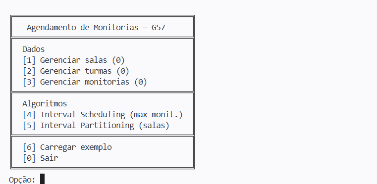

# **Agendamento de Monitorias** — G57

**Disciplina:** Projeto de Algoritmos 
**Módulo:** Algoritmos Ambiciosos/Gulosos/Gananciosos (*Greedy Algorithms*) 
**Algoritmos:** *Interval Scheduling* (Agendamento de Intervalos) & *Interval Partitioning* (Particionamento de Intervalos) 
**Tema:** Agendamento de monitorias 

## Alunos

|Matrícula | Aluno |
| -- | -- |
| 23/1011927  | **João Felipe** Oliveira Alves e Silva |
| 22/2006356  | **Pedro** Lock Martins |

---

## Sobre

O **problema** a se desejar cumprir são ambos os seguintes objetivos:
* Agendar **o máximo de monitorias sem sobreposição temporal** (uma começando antes da outra terminar) para um grupo de salas de aula na UnB/FCTE, levando também em consideração as aulas das turmas que já estão agendadas para ditas salas;
* Agendar um conjunto de monitorias exigindo-se **o mínimo possível de salas de aula distintas** na UnB/FCTE para a cobertura de monitorias sobrepostas temporalmente entre si ou com outras aulas das turmas.

Para a base dessas funções, foram trabalhadas, respectivamente, as implementações *greedy* (ambiciosas/gananciosas/gulosas) dos algoritmos de ***Interval Scheduling*** e ***Interval Partitioning***.

## *Screenshots*
### Captura de Tela 1: Menu principal

### Captura de Tela 2: Uso da função "Carregar exemplo"

### Captura de Tela 3: Uso da função "*Interval Scheduling* (máximo de monitorias)"

### Captura de Tela 4: Uso da função "*Interval Partitioning* (distribuição de salas)"

## Como executar

### Instalação 
Linguagem: C++ 
Framework: *Nenhum* 
 
O projeto depende basicamente apenas da C++ STL (*Standard Template Library*), e por extensão da biblioteca padrão C.
No Windows, também precisa dos cabeçalhos da *Windows API* para a preparação do *console*, que podem ser obtidos com
a instalação do Microsoft Visual Studio, por exemplo.
De qualquer forma, o compilador C++ precisa estar suportando a versão C++20 (em diante) da linguagem. 
 
Para compilar, rode o CMake com o diretório de *Source* sendo a própria pasta deste projeto, e o diretório de *Build* da sua escolha,
mas é preferencialmente recomendado o `{raiz_do_diretório_do_projeto}/build`. Opcionalmente, pode especificar também, por exemplo, um *Generator*
(formato dos arquivos de compilação a serem gerados, ex. Makefile, Ninja, solução do MS Visual Studio etc.) da sua escolha além do padrão. 
Por exemplo, usando a linha de comando: 
`$ cmake -S . -B ./build` (Gerador padrão do sistema), ou: 
`$ cmake -S . -B ./build -G "Ninja Multi-Config"` (Especificando o gerador *Ninja Multi-Config*).  
Após isso, rode normalmente o arquivo de compilação correspondente na pasta de *Build* selecionada para compilar o programa em si, e então, se houver sucesso até aqui, se poderá executá-lo. Por padrão, o executável gerado deverá ter o nome de `G57_Greedy_PA-26.1`, ou *mesmo* `G57_Greedy_PA-26.1.exe` no Windows.

### Uso 
Ao abrir o executável compilado, será exibido um menu no *console* conforme a **Captura de Tela 1**. Digite o número de uma ação a se executar, e pressione a tecla Enter. Então siga as instruções na tela quando exigido, como a digitação dos valores requeridos. 

## Outros 
* Foram necessárias umas certas modificações nos algoritmos básicos de *Interval Scheduling* & *Partitioning*, para lidar com particularidades do problema selecionado como **a setorização da semana em 7 dias**, que por sua vez consistem de 24 * 60 = 1.440 minutos de duração cada — exigindo a "planificação" dos 7 intervalos de tempo diários da semana em 1 só e a validação de parâmetros entrados pelo usuário — e a presença de mais de 1 tipo de intervalo temporal, **monitorias** e **turmas** — exigindo o uso de vários contêineres de dados adicionais, como *arrays* dinâmicos (*vetores*), *heaps* e um dicionário (tabela de *hash*), para lidar-se com a complexidade adicionada —. Mais detalhes podem ser vistos analisando-se o arquivo de código-fonte `source/IntervalUtils.cpp`.

## *Link*(s) do vídeo de entrega
* _ (Parte **1**/2)
* https://youtu.be/1G6LZLceSdU (Parte **2**/2)